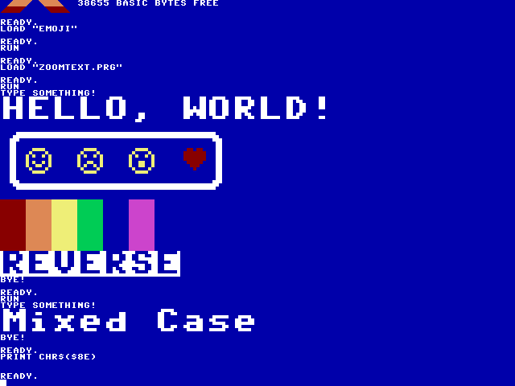

# ZoomText
Zooms an area of text on a Commander X16 display


## Introduction
ZoomText is a simple demo for the Commader X16 retrocomputer that lets you
type in lines of text which are then replaced with "zoomed in" characters
that are 4X the size of the original. This is done through using certain
PETSCII characters (which are 8x8) that can replace 2x2 bitmaps.

As an added bonus, there is a BASIC program that adds some fun emojis to the
PETSCII character set which look especially nice once zoomed.

## Build
If using a pre-built release, skip to [Installation](#installation).

Required tools (all executables assumed to be in path):
* [git](https://git-scm.com/)
* [cc65](https://github.com/cc65/cc65)

First, clone the repo to your local workspace:

```
$ git clone https://github.com/SlithyMatt/x16-zoomtext.git
```

Next, go into the repo directory and run GNU make:

```
$ cd x16-zoomtext
$ make
```

This will create **ZOOMTEXT.PRG** in the repo directory, along with other
build artifacts.

You can use the X16 emulator to build the emoji program from ASCII BASIC code.
First, from the host, load **emoji.bas** into program memory from the command line:

```
$ /path/to/x16emu -bas emoji.bas
```

When the emulator window appears, you will see the code from **emoji.bas** on
the screen. You can save a tokenized binary of the program to load from inside
the emulator by simply saving it from the BASIC prompt:

```
SAVE "EMOJI"
```

Feel free to add more emojis to your program! Just be careful not to destroy
the functionality of ZoomText by overwriting the character tiles for the
following PETSCII codes or their reverses (add hex 80 or decimal 128):

| Hex | Dec | Description |
|--|--|--|
| 20 | 32 | &nbsp;&nbsp;&nbsp; (Space) |
| 6C | 108 | &#9623; (Alt-D) |
| 7B | 123 | &#9622; (Alt-F) |
| 62 | 98 | &#9604; (Alt-I) |
| 7C | 124 | &#9629; (Alt-C) |
| 7E | 126 | &#9624; (Alt-V) |
| 7F | 127 | &#9626; (Alt-B) |
| 61 | 97 | &#9612; (Alt-K) |

## Installation
Copy **ZOOMTEXT.PRG** to the directory from which you will be running the
X16 emulator, or to an SD card (physical or emulated image) that will be
installed (using -sdcard with the emulator, or physically inserted into
the X16). No other files are required to run.

From the X16 BASIC prompt, simply load and run the PRG:

```
LOAD "ZOOMTEXT.PRG"
RUN
```

If loading from a different file device (i.e. not the emulator host file system
or the SD card), append the required arguments to the
LOAD command, as documented in the X16 user's guide.

## User Interface
If you want emojis, start by loading and running **EMOJI** from the BASIC prompt.

If you want to use lower-case letters, switch to lowercase mode by pressing Ctrl-N.
You can't switch between character sets in the middle of running ZoomText, as
the zoomed characters will always be based on the active character set at the
beginning of run time.

Then, load and run **ZOOMTEXT.PRG**.

At the "TYPE SOMETHING!" prompt, simply type something! After you hit Enter,
the line you typed will be replaced with "zoomed" characters. Note that because
the characters are now 4 times as high and wide, the line you type in must take up
no more than a quarter of the current screen width (20 by default) to be fully
rendered as "zoomed". Any characters typed after that will be chopped off.

During run time, you can play around with colors using the standard X16 control
keys. For example, you can switch to red text with Ctrl-3. The color of your
text will be preserved after it is zoomed! Same goes for reverse video, which
is enabled with Ctrl-9 and disabled with Ctrl-0.



When you are done, simply type "QUIT" and you will go back to the BASIC prompt.
Please note that if you have lower-case enabled, you will need to type "quit"
as holding down the shift to capitalize will result in different character codes.

## YouTube Demo
[](https://www.youtube.com/watch?v=NinTloFTCTU)
